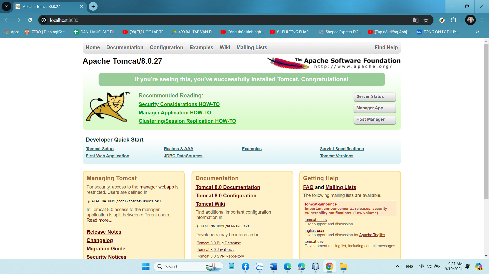
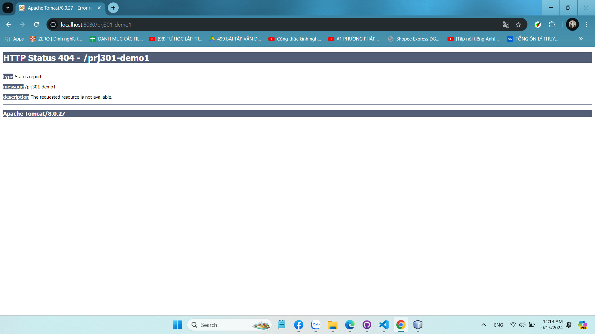
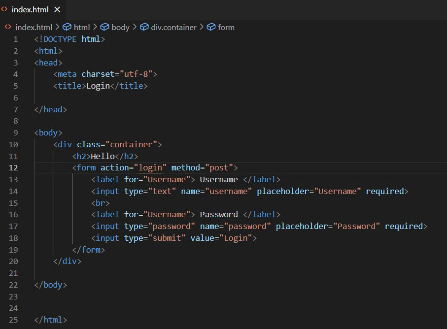

# Exercise 1   

## Milestone 1: Screenshot of the Tomcat installed successfully   

## Milestone 2: Screenshot of the web app prj301-demo1 successfully

## Milestone 3: Screenshot of adding image to login.html

## Milestone 4: Screenshot of creating Login servlet successfully

